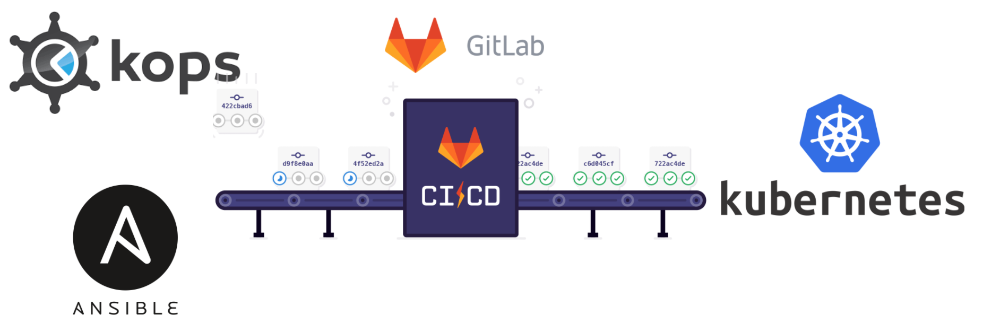
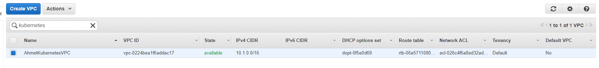
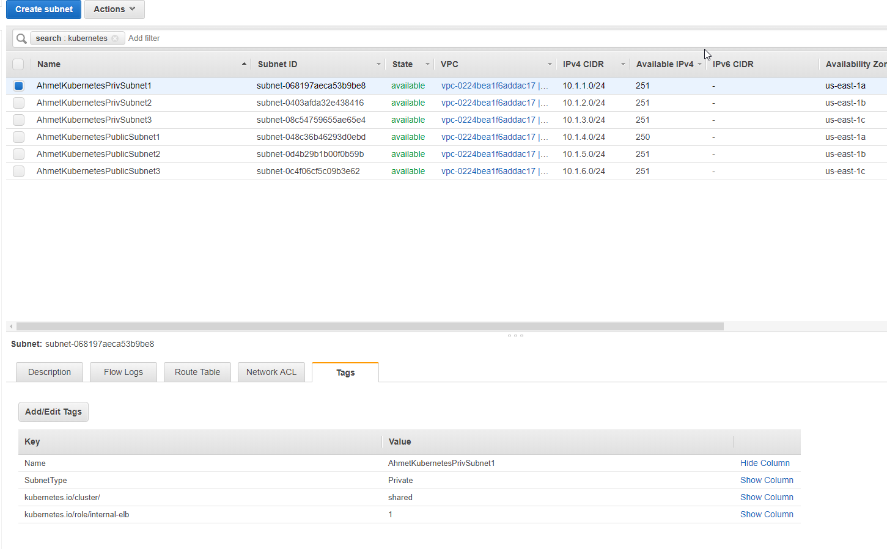
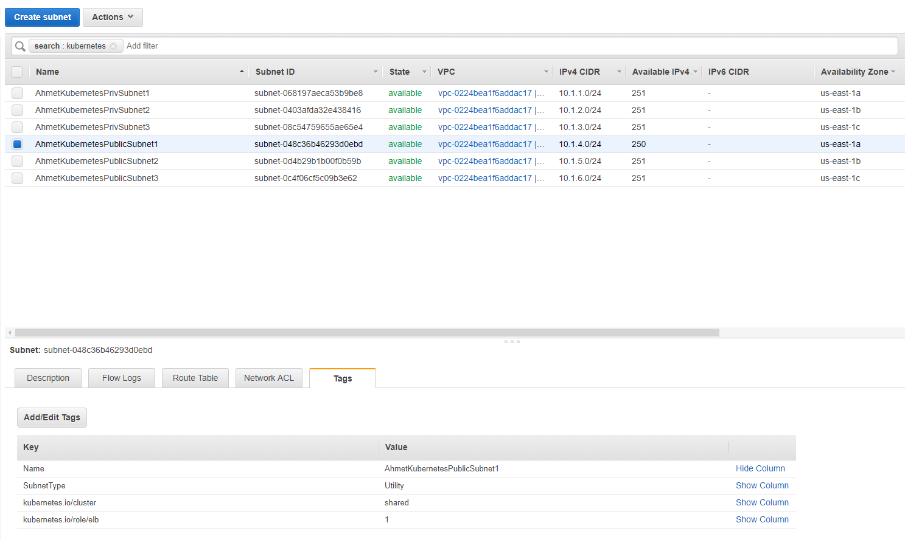
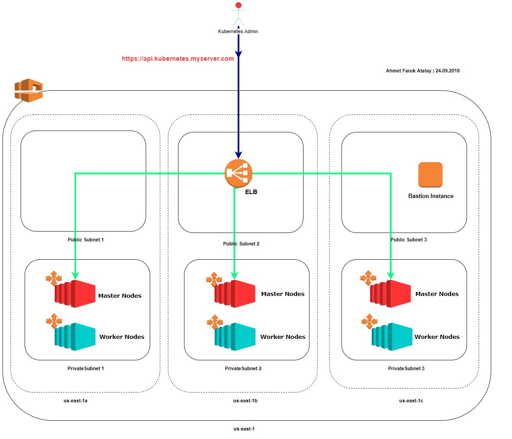
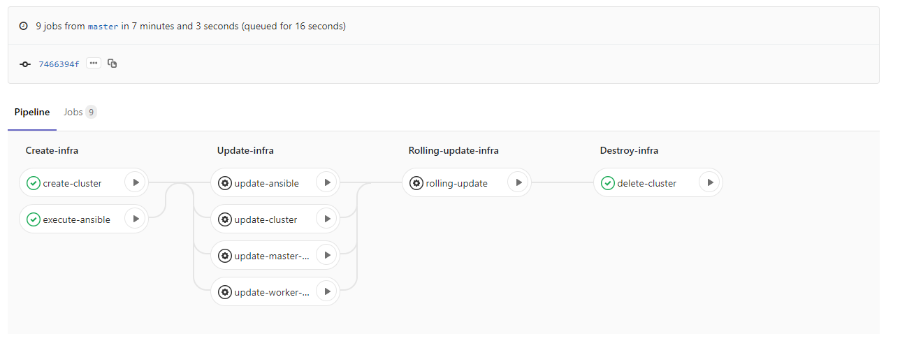

# KUBERNETES INFRASTRUCTURE with KOPS & ANSIBLE & Gitlab-CI

  

## Description
This project contains kops and ansible commands to create kubernetes infrastructure in an "existing" vpc in an AWS. It also includes a gitlab-ci.yml to build an infrastructure in a pipeline. So, with 1 click, you can spin up or update or destroy your cluster.
You can find more information about this project from my blog: [here]( https://medium.com/@ahmetatalay/building-kubernetes-infrastructure-with-kops-ansible-gitlab-ci-ae5271c9844c )

## Prerequisites
To install kubernetes infrastructure in an AWS, you must have existing VPC. To have a vpc, you can build up with "terraform" or manually in aws console.
Your vpc must have 3 private subnets, 3 public subnets, 3 AZs. and following tags in your private subnets:
* SubnetType = Private
* kubernetes.io/cluster/kubernetes.myserver.com = shared
* kubernetes.io/role/internal-elb = 1

VPC:


Private Subnets
  

Following tags must be exist in your public subnets:
* SubnetType = Utility
* kubernetes.io/cluster/kubernetes.myserver.com = shared
* kubernetes.io/role/elb = 1

Public Subnets
  


### Important files in this project:
* kops.sh
* playbook.yml
* kops-update-tempates/values.yaml

#### kops.sh
It includes a bunch of command to execute kops or ansible commands.
* ./kops.sh create-cluster    : create cluster"
* ./kops.sh update-cluster    : update cluster"
* ./kops.sh update-master     : update master nodes"
* ./kops.sh update-worker     : update worker nodes"
* ./kops.sh rolling-update    : rolling update of current cluster/nodes (It takes a great amount of time)"
* ./kops.sh exec-ansible      : execute ansible to insall/update addons in kubernetes cluster"
* ./kops.sh delete-cluster    : delete cluster"

#### playbook.yaml 
* It installs following addons:
   * dashboard 
   * heapster
   * external-dns 
   * autoscaler
   * ingress
   * route53-mapper
   
   
#### kops-update-tempates/values.yaml 
* Replace values of contents in values.yaml. Sample values:
    * CLUSTER_NAME: kubernetes.myserver.com
    * NETWORK_CIDR: 10.0.0.0/16
    * VPC_ID: vpc-12312312313
    * DNS_ZONE_ID: Z1EV1231JAAOJ32
    * SUBNET_CIDR1: 10.0.1.0/24
    * SUBNET_ID1: subnet-2342342342               

```yaml
    CLUSTER_NAME: <CLUSTER_NAME>
    S3_BUCKET_NAME: <S3_BUCKET_NAME>
    SSH_PEM_NAME: kube_clusterkey

    KUBERNETES_VERSION: 1.9.6
    NETWORK_CIDR: <NETWORK_CIDR>
    VPC_ID: <VPC_UD>
    DNS_ZONE_ID: <DNS_ZONE_ID>

    ZONE1: us-east-1a
    ZONE2: us-east-1b
    ZONE3: us-east-1c

    #PRIVATE1 SUBNET
    SUBNET_CIDR1: <SUBNET_CIDR1>
    SUBNET_ID1: <SUBNET_ID1>

    #PRIVATE2 SUBNET
    SUBNET_CIDR2: <SUBNET_CIDR2>
    SUBNET_ID2: <SUBNET_ID2>

    #PRIVATE3 SUBNET
    SUBNET_CIDR3: <SUBNET_CIDR3>
    SUBNET_ID3: <SUBNET_ID3>

    #PUBLIC1(UTILITY) SUBNET
    SUBNET_CIDR4: <SUBNET_CIDR4>
    SUBNET_ID4: <SUBNET_ID4>

    #PUBLIC2(UTILITY) SUBNET
    SUBNET_CIDR5: <SUBNET_CIDR5>
    SUBNET_ID5: <SUBNET_ID5>

    #PUBLIC3(UTILITY) SUBNET
    SUBNET_CIDR6: <SUBNET_CIDR6>
    SUBNET_ID6: <SUBNET_ID6>

    NODES_TYPE: t2.medium
    NODES_DEFAULT_SIZE: 3
    NODES_MIN_SIZE: 3
    NODES_MAX_SIZE: 5

    MASTER_DEFAULT_TYPE: t2.small
    MASTER_DEFAULT_SIZE: 3

    MASTER_US_EAST_1A_TYPE: t2.small
    MASTER_US_EAST_1A_MIN_SIZE: 1
    MASTER_US_EAST_1A_MAX_SIZE: 1

    MASTER_US_EAST_1B_TYPE: t2.small
    MASTER_US_EAST_1B_MIN_SIZE: 1
    MASTER_US_EAST_1B_MAX_SIZE: 1

    MASTER_US_EAST_1C_TYPE: t2.small
    MASTER_US_EAST_1C_MIN_SIZE: 1
    MASTER_US_EAST_1C_MAX_SIZE: 1
```

## High Level Architecture
Here is the high level architecture of kubernetes cluster created by kops. All master and worker nodes will be created with autoscaling group in private subnet(not accessible directly from internet), ELB will be created in public subnet to access kubernetes api server end point from internet.
   

## 1 click infrastructure creation with Gitlab-CI
There are 4 stages(Create, Update, Rolling-update and destroy) in gitlab-ci to take an action in kubernetes cluster
   
